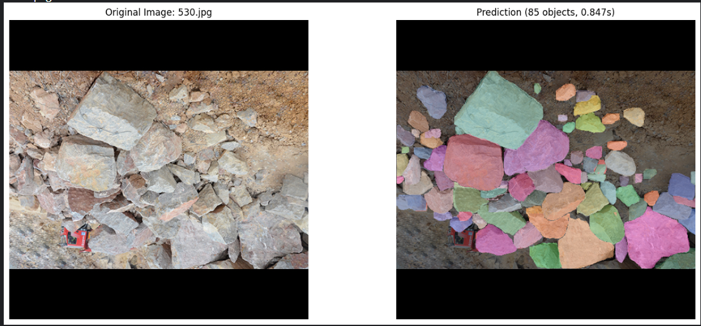

# RGB + v8n

## Performance Metrics

| Model | Box |  |  |  | Mask |  |  |  |
|-------|-----|-----|-----|-----|-----|-----|-----|-----|
|       | P   | R   | mAP50 | mAP50-95 | P   | R   | mAP50 | mAP50-95 |
| v8n   | 0.811 | 0.684 | 0.769 | 0.526 | 0.811 | 0.671 | 0.755 | 0.470 |

## Inference Time

| Model | Average (s) | Median (s) | Min (s) | Max (s) | Std Dev (s) |
|-------|------------|-----------|---------|---------|-------------|
| v8n   | 0.3724     | 0.3302    | 0.1218  | 1.1600  | 0.1914      |

