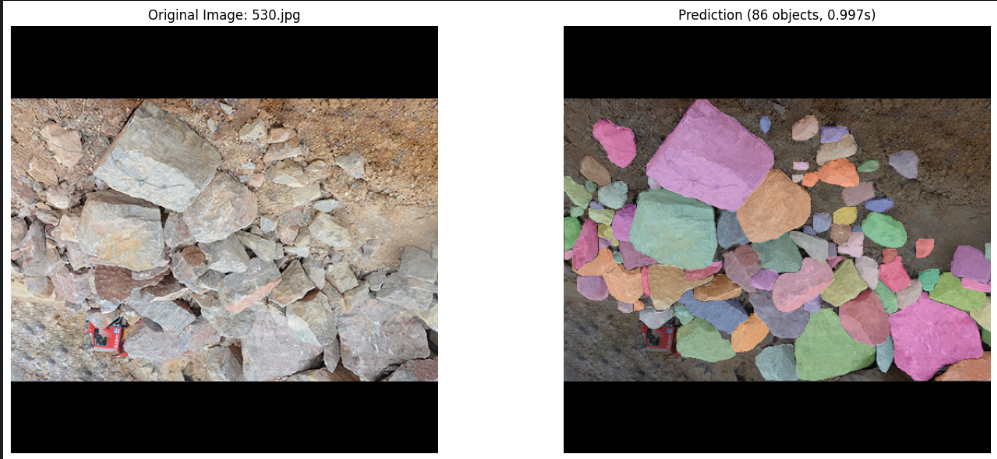

# RGB + v8s

## Performance Metrics

| Model | Box |  |  |  | Mask |  |  |  |
|-------|-----|-----|-----|-----|-----|-----|-----|-----|
|       | P   | R   | mAP50 | mAP50-95 | P   | R   | mAP50 | mAP50-95 |
| v8s   | 0.857 | 0.764 | 0.835 | 0.609 | 0.855 | 0.749 | 0.819 | 0.536 |

## Inference Time

| Model | Average (s) | Median (s) | Min (s) | Max (s) | Std Dev (s) |
|-------|------------|-----------|---------|---------|-------------|
| v8s   | 0.5323     | 0.4741    | 0.2375  | 1.2556  | 0.2015      |

