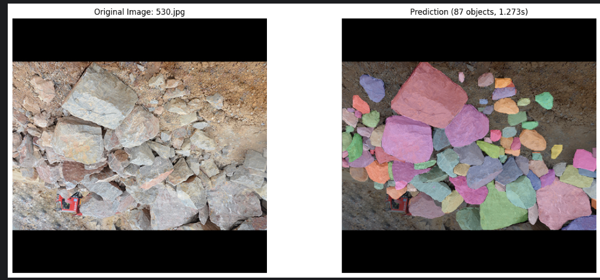

# RGB + v8m

## Performance Metrics

| Model | Box |  |  |  | Mask |  |  |  |
|-------|-----|-----|-----|-----|-----|-----|-----|-----|
|       | P   | R   | mAP50 | mAP50-95 | P   | R   | mAP50 | mAP50-95 |
| v8m   | 0.881 | 0.781 | 0.855 | 0.645 | 0.875 | 0.765 | 0.840 | 0.561 |

## Inference Time

| Model | Average (s) | Median (s) | Min (s) | Max (s) | Std Dev (s) |
|-------|------------|-----------|---------|---------|-------------|
| v8m   | 0.7938     | 0.7675    | 0.4997  | 1.5059  | 0.1967      |

