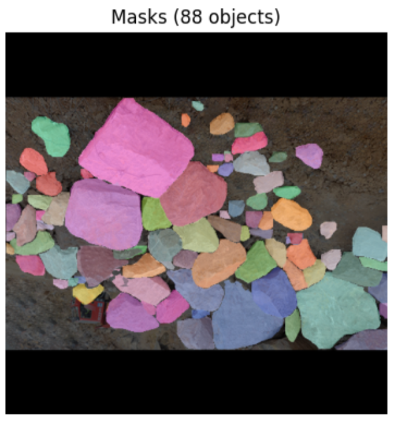

# RGBD + v8n

## Performance Metrics

| Model | Box |  |  |  | Mask |  |  |  |
|-------|-----|-----|-----|-----|-----|-----|-----|-----|
|       | P   | R   | mAP50 | mAP50-95 | P   | R   | mAP50 | mAP50-95 |
| v8n   | 0.94 | 0.815 | 0.886 | 0.7 | 0.94 | 0.805 | 0.879 | 0.627 |

## Inference Time

| Model | Average (s) | Median (s) | Min (s) | Max (s) | Std Dev (s) |
|-------|------------|-----------|---------|---------|-------------|
| v8n   | 0.4139     | 0.3570    | 0.1240  | 1.1669  | 0.2042      |

