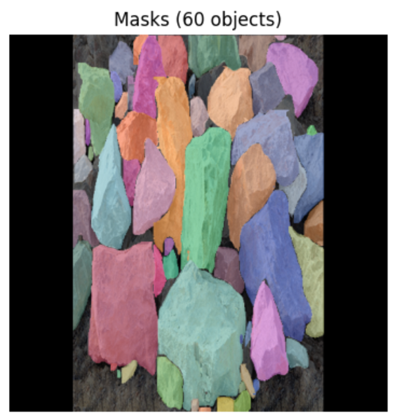

# RGBD + v8s

## Performance Metrics

| Model | Box |  |  |  | Mask |  |  |  |
|-------|-----|-----|-----|-----|-----|-----|-----|-----|
|       | P   | R   | mAP50 | mAP50-95 | P   | R   | mAP50 | mAP50-95 |
| v8s   | 0.944 | 0.863 | 0.916 | 0.76 | 0.945 | 0.848 | 0.908 | 0.676 |

## Inference Time

| Model | Average (s) | Median (s) | Min (s) | Max (s) | Std Dev (s) |
|-------|------------|-----------|---------|---------|-------------|
| v8s   | 0.5682     | 0.5358    | 0.2583  | 1.3058  | 0.2125      |

