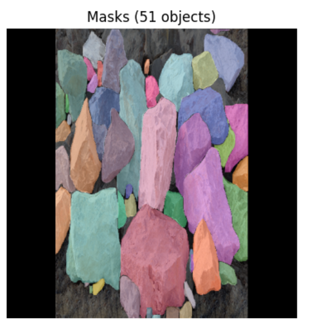

# RGBD + v8m

## Performance Metrics

| Model | Box |  |  |  | Mask |  |  |  |
|-------|-----|-----|-----|-----|-----|-----|-----|-----|
|       | P   | R   | mAP50 | mAP50-95 | P   | R   | mAP50 | mAP50-95 |
| v8m   | 0.97 | 0.896 | 0.941 | 0.808 | 0.966 | 0.88 | 0.931 | 0.711 |

## Inference Time

| Model | Average (s) | Median (s) | Min (s) | Max (s) | Std Dev (s) |
|-------|------------|-----------|---------|---------|-------------|
| v8m   | 0.7991     | 0.7631    | 0.5273  | 1.5642  | 0.2125      |

