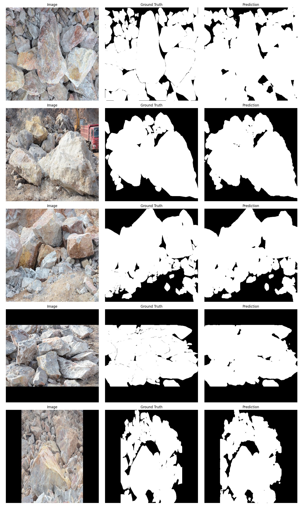
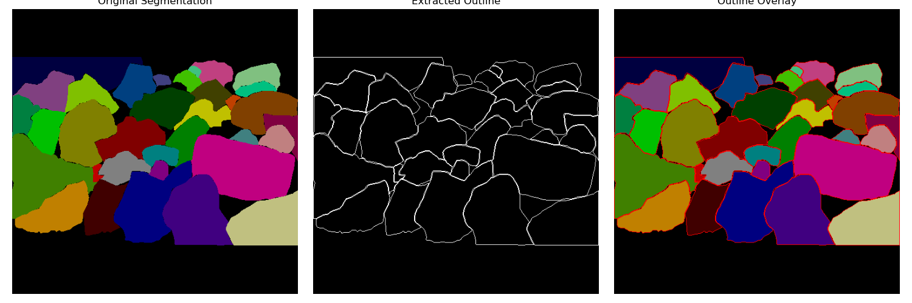

# SHRINK IDEA

After some testing, we got incredible results with over 95% IoU.
However, if we check the below output image:

We can see the model can't predict the outline of the objects. That's mean with the output, its nearly impossible to identity seperate fragments!!!

For now, it's not a problem, but we need to fix it for phrase 2 I believe!

So to fix this, an idea is that I will "shrink" the mask by a few pixels. This will make the mask smaller (possibly lose performance) but it will make the mask more accurate!!

Check [this file](outline.py) to see the code and check this image:

> Note that the above file is used in [new shrinking](../../script/[new]-shrinking.ipynb), not the old one!
